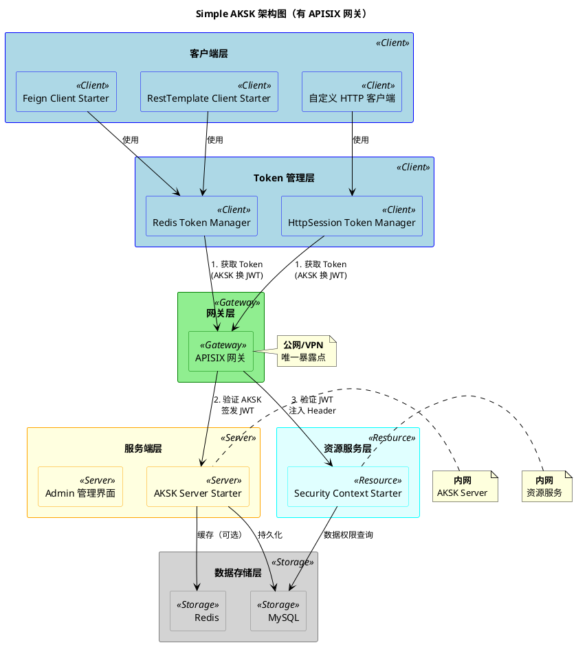
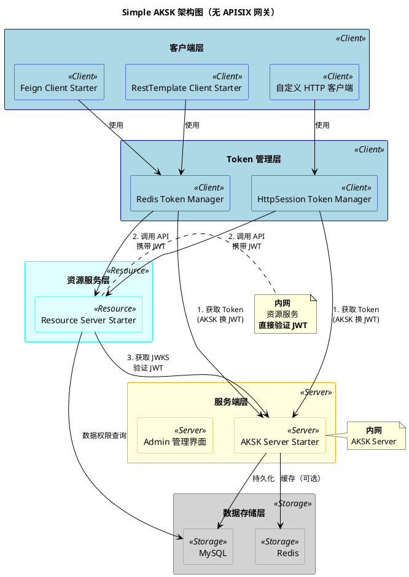

# Simple AKSK 用户手册

## 目录

- [1. 概述](#1-概述)
- [2. 架构设计](#2-架构设计)
- [3. 核心模块介绍](#3-核心模块介绍)
- [4. 服务端模块](#4-服务端模块)
- [5. 客户端模块](#5-客户端模块)
- [6. 资源服务端模块](#6-资源服务端模块)
- [7. 部署架构](#7-部署架构)
- [8. 快速开始](#8-快速开始)
- [9. 常见问题](#9-常见问题)

---

## 1. 概述

### 1.1 什么是 Simple AKSK？

Simple AKSK 是一套基于 OAuth2 Client Credentials Grant 的 API 认证解决方案，为产品线（PL）和外部系统提供统一的 OpenAPI 认证机制，类似 AWS/阿里云的 AKSK（AccessKey/SecretKey）认证模式。

### 1.2 核心特性

- **双层级 AKSK 管理**：支持平台级（AKP）和用户级（AKU）两种 AKSK 类型
- **OAuth2 标准协议**：基于 Spring Authorization Server 0.4.0，完全符合 OAuth2 规范
- **JWT Token 签发**：使用 RSA 算法签发 JWT Token，支持自定义公私钥
- **多种客户端实现**：支持 Feign、RestTemplate 等多种 HTTP 客户端
- **灵活的 Token 管理**：支持 Redis 和 HttpSession 两种 Token 缓存策略
- **资源保护**：提供 JWT 验证和 HTTP Header 解析两种资源保护方式
- **权限注解**：提供 4 种权限校验注解，支持 SpEL 表达式

### 1.3 技术栈

| 组件 | 版本 | 说明 |
|------|------|------|
| Spring Boot | 2.7.9 | 项目现有版本 |
| Spring Authorization Server | 0.4.0 | 支持 Java 8 的最后版本 |
| Spring Security | 5.7.x | 随 SpringBoot 2.7.9 自动管理 |
| Java | 8 | 项目现有版本 |
| APISIX | 3.x | API 网关，负责 JWT 验证（可选） |
| Redis | - | Token 存储（可选） |
| MySQL | 5.7/8.4 | Spring Authorization Server 数据持久化 |

---

## 2. 架构设计

### 2.1 整体架构

Simple AKSK 采用分层架构设计，包含以下层次：

```
┌─────────────────────────────────────────────────────────────────┐
│                        客户端层 (Client)                         │
│  ┌──────────────────┐  ┌──────────────────┐  ┌──────────────────┐ │
│  │ Feign Client    │  │ RestTemplate     │  │ 自定义 HTTP      │ │
│  │ Starter         │  │ Client Starter   │  │ 客户端           │ │
│  └──────────────────┘  └──────────────────┘  └──────────────────┘ │
└─────────────────────────────────────────────────────────────────┘
                              ↓
┌─────────────────────────────────────────────────────────────────┐
│                        Token 管理层                              │
│  ┌──────────────────┐  ┌──────────────────┐                      │
│  │ Redis Token      │  │ HttpSession      │                      │
│  │ Manager          │  │ Token Manager    │                      │
│  └──────────────────┘  └──────────────────┘                      │
└─────────────────────────────────────────────────────────────────┘
                              ↓
┌─────────────────────────────────────────────────────────────────┐
│                        网关层 (Gateway)                          │
│  ┌──────────────────────────────────────────────────────────┐   │
│  │  APISIX (可选)                                            │   │
│  │  - JWT 验证                                               │   │
│  │  - 请求头注入                                             │   │
│  └──────────────────────────────────────────────────────────┘   │
└─────────────────────────────────────────────────────────────────┘
                              ↓
┌─────────────────────────────────────────────────────────────────┐
│                        服务端层 (Server)                         │
│  ┌──────────────────┐  ┌──────────────────┐                      │
│  │ AKSK Server      │  │ Admin 管理界面    │                      │
│  │ Starter          │  │                  │                      │
│  └──────────────────┘  └──────────────────┘                      │
└─────────────────────────────────────────────────────────────────┘
                              ↓
┌─────────────────────────────────────────────────────────────────┐
│                        资源服务层 (Resource)                      │
│  ┌──────────────────┐  ┌──────────────────┐                      │
│  │ Resource Server  │  │ Security Context │                      │
│  │ Starter          │  │ Starter          │                      │
│  │ (JWT 验证)       │  │ (Header 解析)    │                      │
│  └──────────────────┘  └──────────────────┘                      │
└─────────────────────────────────────────────────────────────────┘
                              ↓
┌─────────────────────────────────────────────────────────────────┐
│                        数据存储层                                │
│  ┌──────────────────┐  ┌──────────────────┐                      │
│  │ MySQL            │  │ Redis            │                      │
│  │ (持久化)         │  │ (缓存)           │                      │
│  └──────────────────┘  └──────────────────┘                      │
└─────────────────────────────────────────────────────────────────┘
```

### 2.2 部署架构

Simple AKSK 支持两种部署架构：

#### 架构 1：有 APISIX 网关（推荐）

适用于生产环境，通过 APISIX 网关统一验证 JWT，最小化公网暴露面。

#### 架构 2：无 APISIX 网关

适用于测试环境或内网环境，资源服务直接验证 JWT。

详细架构图请参考 [7. 部署架构](#7-部署架构)。

---

## 3. 核心模块介绍

### 3.1 simple-aksk-core

**模块类型**：核心模块

**功能描述**：
AKSK 认证体系的核心模块，提供跨模块共享的常量、模型、工具类和异常定义。

**核心能力**：

1. **常量定义**
   - `AkskConstant` - AKSK 系统常量（Client ID 前缀、Secret Key 前缀等）
   - `ClientType` - 客户端类型枚举（PLATFORM=1, USER=2）
   - `HeaderConstant` - HTTP 请求头常量
   - `JwtClaimConstant` - JWT Claim 常量
   - `ErrorCode` - 错误码定义
   - `ErrorMessage` - 错误消息定义

2. **数据模型**
   - `ClientInfo` - 客户端信息模型
   - `TokenInfo` - Token 信息模型

3. **工具类**
   - `Base62Helper` - Base62 编解码工具（用于生成简短的 Client ID）
   - `SecurityContextHelper` - 安全上下文工具（解析 JWT Token 中的 security_context）

4. **异常定义**
   - `AkskException` - AKSK 异常基类

**依赖说明**：
- 纯 Java 模块，无 Spring 依赖
- 可被 Server 端和 Client 端同时使用

**适用场景**：
- 所有 AKSK 模块的公共依赖
- 需要访问 AKSK 常量、模型、工具类的场景

---

## 4. 服务端模块

### 4.1 simple-aksk-server-starter

**模块类型**：服务端 Starter

**功能描述**：
基于 Spring Authorization Server 的 AKSK 认证服务器 Starter，支持平台级和用户级 AKSK 管理，提供完整的 OAuth2 Client Credentials 授权流程。

**核心能力**：

1. **双层级 AKSK 管理**
   - 平台级 AKSK（AKP）：不绑定用户，权限范围广
   - 用户级 AKSK（AKU）：绑定用户，权限范围窄

2. **OAuth2 标准协议**
   - 基于 Spring Authorization Server 0.4.0
   - 完全符合 OAuth2 规范
   - 支持 Client Credentials Grant 流程

3. **JWT Token 签发**
   - 使用 RSA 算法签发 JWT Token
   - 支持自定义公私钥
   - 支持自定义 Token 过期时间

4. **Client 管理 API**
   - 创建 Client（支持平台级和用户级）
   - 查询 Client 列表（支持分页和过滤）
   - 查询 Client 详情
   - 删除 Client
   - 批量同步用户权限
   - 批量查询 Client 信息

5. **Token 管理 API**
   - 查询 Token 列表（MySQL）
   - 查询 Redis 中的 Token 列表
   - 查询 Token 详情
   - 删除单个 Token
   - 清理过期 Token
   - 获取 Token 统计信息

6. **Admin 管理界面**
   - AKSK 创建、查询、启用/禁用、删除
   - Token 查询、删除、清理过期 Token
   - Web 管理界面（Thymeleaf）

7. **Redis 缓存支持**
   - 可选的 Redis 缓存
   - 提升 Token 验证性能

8. **安全上下文传递**
   - 支持在 Token 中携带自定义安全上下文信息
   - 最大 4KB（可配置）

**配置示例**：

```yaml
spring:
  datasource:
    url: jdbc:mysql://localhost:3306/sure_auth_aksk
    username: root
    password: your_password

io:
  github:
    surezzzzzz:
      sdk:
        auth:
          aksk:
            server:
              jwt:
                key-id: sure-auth-aksk-2026
                expires-in: 3600
                public-key: classpath:keys/public.pem
                private-key: classpath:keys/private.pem
              redis:
                enabled: false
              admin:
                enabled: true
                username: admin
                password: admin123
```

**API 接口**：

| 端点 | 方法 | 说明 |
|------|------|------|
| `/oauth2/token` | POST | 获取 Access Token |
| `/.well-known/oauth-authorization-server` | GET | OAuth2 授权服务器元数据 |
| `/oauth2/jwks` | GET | JWKS 公钥端点 |
| `/api/client` | POST | 创建 Client |
| `/api/client` | GET | 查询 Client 列表 |
| `/api/client/{clientId}` | GET | 查询 Client 详情 |
| `/api/client/{clientId}` | DELETE | 删除 Client |
| `/api/client?owner_user_id={userId}` | PATCH | 批量同步用户权限 |
| `/api/token` | GET | 查询 Token 列表 |
| `/api/token/{id}` | DELETE | 删除 Token |
| `/api/token/expired` | DELETE | 清理过期 Token |
| `/api/token/statistics` | GET | 获取 Token 统计信息 |

**适用场景**：
- 需要提供 AKSK 认证服务的场景
- 需要管理平台级和用户级 AKSK 的场景
- 需要签发 JWT Token 的场景

---

## 5. 客户端模块

### 5.1 simple-aksk-client-core

**模块类型**：客户端核心模块

**功能描述**：
AKSK 客户端的核心模块，提供 Token 管理的抽象接口、安全上下文管理、Token 刷新执行器等基础能力。

**核心能力**：

1. **Token 管理抽象**
   - `TokenManager` - Token 管理器接口
   - `TokenCacheStrategy` - Token 缓存策略接口

2. **Token 刷新执行器**
   - `TokenRefreshExecutor` - Token 刷新执行器
   - 使用 AKSK 向 OAuth2 Server 换取 Access Token
   - 自动解析 JWT Token 并检查状态

3. **安全上下文管理**
   - `SecurityContextProvider` - 安全上下文提供者接口
   - `DefaultSecurityContextProvider` - 默认实现
   - `StaticSecurityContextProvider` - 静态实现

4. **配置管理**
   - `SimpleAkskClientCoreProperties` - 客户端配置

5. **异常体系**
   - `SimpleAkskClientCoreException` - 客户端异常基类
   - `ConfigurationException` - 配置异常
   - `TokenFetchException` - Token 获取异常
   - `TokenLockException` - Token 锁异常
   - `TokenParseException` - Token 解析异常

**适用场景**：
- 需要实现自定义 TokenManager 的场景
- 需要实现自定义 SecurityContextProvider 的场景

---

### 5.2 simple-aksk-redis-token-manager

**模块类型**：Token 管理器

**功能描述**：
基于 Redis 的 Token 管理器实现，提供分布式 Token 缓存和并发控制能力。

**核心能力**：

1. **Redis Token 管理**
   - 实现 `TokenManager` 接口
   - 支持 Redis 缓存 Token
   - 分布式锁保证并发安全
   - 自动 Token 过期检查和刷新

2. **分布式锁机制**
   - 使用 `simple-redis-lock-starter` 实现分布式锁
   - 锁超时时间：10秒
   - 递归重试策略

3. **Token 缓存策略**
   - 缓存 Key 格式：`sure-auth-aksk-client:{me}:token::{hashCode}`
   - 默认 Key（无 security_context）：`sure-auth-aksk-client:{me}:token::{default}`
   - 用户级 Key（有 security_context）：基于 hashCode 隔离

**配置示例**：

```yaml
spring:
  redis:
    host: localhost
    port: 6379

io:
  github:
    surezzzzzz:
      sdk:
        auth:
          aksk:
            client:
              enable: true
              client-id: AKP1234567890abcdefgh
              client-secret: SK1234567890abcdefghijklmnopqrstuvwxyz1234
              server-url: http://localhost:8080
              token-endpoint: /oauth2/token
              redis:
                token:
                  me: my-app
```

**适用场景**：
- 多实例部署场景
- 需要跨实例共享 Token 的场景
- 需要分布式并发控制的场景

---

### 5.3 simple-aksk-httpsession-token-manager

**模块类型**：Token 管理器

**功能描述**：
基于 HttpSession 的 AKSK Token 管理器，提供简单直接的 Token 缓存和管理能力。

**核心能力**：

1. **HttpSession 缓存**
   - 使用 HttpSession 存储 Token，无需额外依赖
   - Token 自动过期管理（提前 30 秒失效）
   - 支持基于 `security_context` 的多租户/多用户 Token 隔离

2. **自动 Token 刷新**
   - Token 过期自动重新获取
   - Token 即将过期时异步刷新
   - 统一使用 `TokenRefreshExecutor` 处理刷新逻辑

3. **并发安全**
   - JVM 本地锁（`synchronized`）防止同一实例内并发获取
   - Double-check 机制减少不必要的服务器请求

**适用场景**：
- 单实例应用
- 不需要跨实例共享 Token 的场景
- 希望简化依赖的项目

---

### 5.4 simple-aksk-feign-redis-client-starter

**模块类型**：客户端 Starter

**功能描述**：
基于 Spring Cloud OpenFeign 的 AKSK 客户端 Starter，集成 Redis Token Manager，提供开箱即用的声明式 HTTP 客户端。

**核心能力**：

1. **声明式 Feign 客户端**
   - `@AkskClientFeignClient` - 自定义 Feign 注解（推荐）
   - 自动配置 `AkskFeignConfiguration`
   - 自动添加 `Authorization: Bearer {token}` 请求头

2. **AKSK 认证拦截器**
   - `AkskFeignRequestInterceptor` - Feign 请求拦截器
   - 自动从 `TokenManager` 获取 Token
   - 自动添加 `Authorization` 请求头

3. **Redis Token 管理**
   - 集成 `simple-aksk-redis-token-manager`
   - 支持分布式 Token 缓存
   - 支持并发控制和自动刷新

4. **灵活的组件选择**
   - TokenManager - 只需要 Token 管理
   - `@AkskClientFeignClient` - 需要自动添加认证头的 Feign 客户端
   - `AkskFeignConfiguration` - 需要显式配置 Feign 客户端

**配置示例**：

```yaml
spring:
  redis:
    host: localhost
    port: 6379

io:
  github:
    surezzzzzz:
      sdk:
        auth:
          aksk:
            client:
              enable: true
              client-id: AKP1234567890abcdefgh
              client-secret: SK1234567890abcdefghijklmnopqrstuvwxyz1234
              server-url: http://localhost:8080
```

**使用示例**：

```java
@AkskClientFeignClient(name = "my-service", url = "http://localhost:8080")
public interface MyServiceClient {

    @GetMapping("/api/resource")
    String getResource();
}

@Service
public class MyService {

    @Autowired
    private MyServiceClient myServiceClient;

    public String callApi() {
        return myServiceClient.getResource();
    }
}
```

**适用场景**：
- 使用 Spring Cloud OpenFeign 的项目
- 微服务间调用场景
- 需要声明式 HTTP 客户端的场景

---

### 5.5 simple-aksk-resttemplate-redis-client-starter

**模块类型**：客户端 Starter

**功能描述**：
基于 RestTemplate 的 AKSK 客户端 Starter，集成 Redis Token Manager，提供开箱即用的 HTTP 客户端。

**核心能力**：

1. **自动配置的 RestTemplate**
   - `akskClientRestTemplate` - 预配置的 RestTemplate Bean
   - 自动注入 `AkskRestTemplateInterceptor` 拦截器
   - 自动添加 `Authorization: Bearer {token}` 请求头

2. **AKSK 认证拦截器**
   - `AkskRestTemplateInterceptor` - RestTemplate 拦截器
   - 自动从 `TokenManager` 获取 Token
   - 自动添加 `Authorization` 请求头

3. **Redis Token 管理**
   - 集成 `simple-aksk-redis-token-manager`
   - 支持分布式 Token 缓存
   - 支持并发控制和自动刷新

4. **灵活的组件选择**
   - TokenManager - 只需要 Token 管理
   - akskClientRestTemplate - 需要自动添加认证头的 RestTemplate
   - AkskRestTemplateInterceptor - 需要自定义 RestTemplate 配置

**配置示例**：

```yaml
spring:
  redis:
    host: localhost
    port: 6379

io:
  github:
    surezzzzzz:
      sdk:
        auth:
          aksk:
            client:
              enable: true
              client-id: AKP1234567890abcdefgh
              client-secret: SK1234567890abcdefghijklmnopqrstuvwxyz1234
              server-url: http://localhost:8080
              resttemplate:
                enable: true
```

**使用示例**：

```java
@Service
public class MyService {

    @Autowired
    @Qualifier("akskClientRestTemplate")
    private RestTemplate akskClientRestTemplate;

    public String callApi() {
        String url = "http://localhost:8080/api/resource";
        ResponseEntity<String> response = akskClientRestTemplate.getForEntity(url, String.class);
        return response.getBody();
    }
}
```

**适用场景**：
- 使用 RestTemplate 的项目
- 通用 HTTP 调用场景
- 需要灵活配置 HTTP 客户端的场景

---

## 6. 资源服务端模块

### 6.1 simple-aksk-resource-core

**模块类型**：资源保护核心模块

**功能描述**：
AKSK 资源保护核心模块，提供统一的安全上下文抽象和权限注解支持。

**核心能力**：

1. **SimpleAkskSecurityContextProvider 接口**
   - 定义如何获取安全上下文的抽象接口
   - 提供便捷方法（getUserId、getUsername、getClientId 等）

2. **权限注解**
   - `@RequireContext` - 要求存在安全上下文
   - `@RequireField` - 要求存在指定字段
   - `@RequireFieldValue` - 要求字段值匹配
   - `@RequireExpression` - 要求 SpEL 表达式为 true

3. **SimpleAkskSecurityAspect 切面**
   - 实现权限注解的 AOP 校验逻辑
   - 支持方法级别和类级别注解
   - 校验失败抛出 `SimpleAkskSecurityException`

4. **SimpleAkskResourceConstant 常量类**
   - 定义统一的命名规范和映射关系
   - 字段名称（camelCase）
   - JWT Claim 名称（snake_case）
   - HTTP Header 名称（kebab-case）

5. **SimpleAkskSecurityException 异常**
   - 权限校验失败时抛出的运行时异常

**适用场景**：
- 需要实现自定义安全上下文提供者的场景
- 需要使用权限注解的场景
- 需要扩展资源保护功能的场景

---

### 6.2 simple-aksk-resource-server-starter

**模块类型**：资源服务端 Starter

**功能描述**：
资源服务器端 JWT 验证器，直接验证 JWT token 并提供便捷的 API 访问用户信息（适用于无网关场景）。

**核心能力**：

1. **JWT Token 验证**
   - Spring Security OAuth2 Resource Server - JWT 验证
   - 使用 RSA 公钥验证 JWT 签名
   - 支持从配置字符串或文件加载公钥
   - 自动验证 token 有效期和签名

2. **自动提取 JWT Claims**
   - `AkskJwtAuthenticationConverter` - JWT 转换器
   - 自动提取 JWT claims 并转换为 camelCase 格式
   - 存储到 Request Attribute（线程池安全）
   - 支持标准 claims 和自定义 claims

3. **便捷的静态 API**
   - `SimpleAkskSecurityContextHelper` - 安全上下文 API
   - 类似 Shiro 的便捷 API 风格
   - 基于 Request Attribute 实现
   - 支持获取预定义字段和任意自定义字段

4. **Provider 实现**
   - `AkskJwtContextProvider` - 上下文提供者实现
   - 实现 `SimpleAkskSecurityContextProvider` 接口
   - 适配 SimpleAkskSecurityContextHelper 的静态方法

5. **权限注解**
   - `@RequireContext` - 要求存在安全上下文
   - `@RequireField` - 要求存在指定字段
   - `@RequireFieldValue` - 要求字段值匹配
   - `@RequireExpression` - 要求 SpEL 表达式为 true

6. **路径安全配置**
   - 保护路径 - 需要 JWT 认证的路径
   - 白名单路径 - 不需要认证的路径
   - 灵活配置 - 支持 Ant 风格路径匹配

**配置示例**：

```yaml
io:
  github:
    surezzzzzz:
      sdk:
        auth:
          aksk:
            resource:
              server:
                enabled: true
                jwt:
                  issuer-uri: http://localhost:8080
                security:
                  protected-paths:
                    - /api/**
                    - /secure/**
                  permit-all-paths:
                    - /api/health
```

**使用示例**：

```java
@RestController
@RequestMapping("/api")
public class UserController {

    @GetMapping("/user/info")
    public UserInfo getUserInfo() {
        String userId = SimpleAkskSecurityContextHelper.getUserId();
        String username = SimpleAkskSecurityContextHelper.getUsername();
        String clientId = SimpleAkskSecurityContextHelper.getClientId();
        return new UserInfo(userId, username, clientId);
    }

    @GetMapping("/orders")
    @RequireField("tenantId")
    public List<Order> getOrders() {
        String tenantId = SimpleAkskSecurityContextHelper.get("tenantId");
        return orderService.getOrdersByTenant(tenantId);
    }
}
```

**适用场景**：
- 无 APISIX 网关的场景
- 资源服务直接验证 JWT 的场景
- 需要本地验证 JWT 签名的场景

---

### 6.3 simple-aksk-security-context-starter

**模块类型**：资源服务端 Starter

**功能描述**：
资源服务器端安全上下文解析器，从 HTTP Header 自动提取用户信息并提供便捷的 API 访问（适用于有网关场景）。

**核心能力**：

1. **自动提取 HTTP Header**
   - `AkskSecurityContextFilter` - 安全上下文过滤器
   - 自动提取以指定前缀开头的 HTTP Header
   - 移除前缀并转换为 camelCase 格式
   - 存储到 Request Attribute（线程池安全）

2. **便捷的静态 API**
   - `SimpleAkskSecurityContextHelper` - 用户上下文 API
   - 类似 Shiro 的便捷 API 风格
   - 基于 Request Attribute 实现
   - 支持获取预定义字段和任意自定义字段
   - 支持数组字段自动提取

3. **Provider 实现**
   - `AkskUserContextProvider` - 上下文提供者实现
   - 实现 `SimpleAkskSecurityContextProvider` 接口
   - 适配 SimpleAkskSecurityContextHelper 的静态方法

4. **权限注解**
   - `@RequireContext` - 要求存在安全上下文
   - `@RequireField` - 要求存在指定字段
   - `@RequireFieldValue` - 要求字段值匹配
   - `@RequireExpression` - 要求 SpEL 表达式为 true

5. **Header 名称转换**
   - `HeaderNameConverter` - 名称转换工具
   - 移除前缀（如 `x-sure-auth-aksk-`）
   - 转换为 camelCase 格式

**配置示例**：

```yaml
io:
  github:
    surezzzzzz:
      sdk:
        auth:
          aksk:
            resource:
              security-context:
                enable: true
                header-prefix: x-sure-auth-aksk-
```

**使用示例**：

```java
@RestController
@RequestMapping("/api")
public class UserController {

    @GetMapping("/user/info")
    public UserInfo getUserInfo() {
        String userId = SimpleAkskSecurityContextHelper.getUserId();
        String username = SimpleAkskSecurityContextHelper.getUsername();
        List<String> roles = SimpleAkskSecurityContextHelper.getRoles();
        return new UserInfo(userId, username, roles);
    }

    @GetMapping("/orders")
    @RequireField("tenantId")
    public List<Order> getOrders() {
        String tenantId = SimpleAkskSecurityContextHelper.get("tenantId");
        return orderService.getOrdersByTenant(tenantId);
    }
}
```

**适用场景**：
- 有 APISIX 网关的场景
- 网关已验证 JWT 并注入 Header 的场景
- 需要从 Header 提取用户信息的场景

---

## 7. 部署架构

### 7.1 架构 1：有 APISIX 网关（推荐）

适用于生产环境，通过 APISIX 网关统一验证 JWT，最小化公网暴露面。



**流程说明**：

1. **Token 获取流程**
   - 客户端使用 AKSK 向 APISIX 发送请求
   - APISIX 转发到 AKSK Server
   - AKSK Server 验证 AKSK，签发 JWT Token
   - 客户端缓存 JWT Token

2. **API 调用流程**
   - 客户端使用 JWT Token 调用 API
   - APISIX 验证 JWT 签名和有效期
   - APISIX 提取 JWT 信息并注入 HTTP Header
   - 资源服务从 Header 读取用户信息
   - 资源服务执行业务逻辑

**APISIX 注入的 HTTP Header**：

| Header 名称 | 说明 |
|------------|------|
| `x-sure-auth-aksk-client-id` | Client ID |
| `x-sure-auth-aksk-user-id` | 用户 ID |
| `x-sure-auth-aksk-username` | 用户名 |
| `x-sure-auth-aksk-roles` | 角色列表 |
| `x-sure-auth-aksk-scope` | Scope 列表 |
| `x-sure-auth-aksk-security-context` | 安全上下文 |

---

### 7.2 架构 2：无 APISIX 网关

适用于测试环境或内网环境，资源服务直接验证 JWT。



**流程说明**：

1. **Token 获取流程**
   - 客户端使用 AKSK 向 AKSK Server 发送请求
   - AKSK Server 验证 AKSK，签发 JWT Token
   - 客户端缓存 JWT Token

2. **API 调用流程**
   - 客户端使用 JWT Token 调用 API
   - 资源服务直接验证 JWT 签名和有效期
   - 资源服务提取 JWT Claims
   - 资源服务执行业务逻辑

**两种架构对比**：

| 特性 | 有 APISIX 网关 | 无 APISIX 网关 |
|------|-------------|-------------|
| **适用场景** | 生产环境 | 测试/内网环境 |
| **JWT 验证** | 网关验证 | 资源服务验证 |
| **公网暴露** | 最小化（仅网关） | 较大（多个服务） |
| **性能** | 网关集中验证 | 分布式验证 |
| **复杂度** | 较高 | 较低 |
| **资源服务 Starter** | Security Context Starter | Resource Server Starter |

---

## 8. 快速开始

### 8.1 服务端快速开始

#### 1. 添加依赖

```gradle
dependencies {
    implementation 'io.github.sure-zzzzzz:simple-aksk-server-starter:1.0.0'
    implementation 'org.springframework.boot:spring-boot-starter-web'
    implementation 'org.springframework.boot:spring-boot-starter-security'
    implementation 'org.springframework.boot:spring-boot-starter-data-jpa'
    runtimeOnly 'mysql:mysql-connector-java:8.0.33'
}
```

#### 2. 初始化数据库

```bash
mysql -u root -p < docs/00_database.sql
mysql -u root -p sure_auth_aksk < docs/01_schema.sql
```

#### 3. 配置应用

```yaml
spring:
  datasource:
    url: jdbc:mysql://localhost:3306/sure_auth_aksk
    username: root
    password: your_password

io:
  github:
    surezzzzzz:
      sdk:
        auth:
          aksk:
            server:
              jwt:
                public-key: classpath:keys/public.pem
                private-key: classpath:keys/private.pem
              admin:
                enabled: true
                username: admin
                password: admin123
```

#### 4. 启动应用

```java
@SpringBootApplication
public class Application {
    public static void main(String[] args) {
        SpringApplication.run(Application.class, args);
    }
}
```

#### 5. 创建 AKSK

访问 `http://localhost:8080/admin`，使用管理员账号登录，创建 AKSK。

---

### 8.2 客户端快速开始（Feign）

#### 1. 添加依赖

```gradle
dependencies {
    implementation 'io.github.sure-zzzzzz:simple-aksk-feign-redis-client-starter:1.0.0'
    implementation 'org.springframework.cloud:spring-cloud-starter-openfeign:3.1.8'
    implementation 'org.springframework.boot:spring-boot-starter-data-redis'
}
```

#### 2. 配置应用

```yaml
spring:
  redis:
    host: localhost
    port: 6379

io:
  github:
    surezzzzzz:
      sdk:
        auth:
          aksk:
            client:
              enable: true
              client-id: AKP1234567890abcdefgh
              client-secret: SK1234567890abcdefghijklmnopqrstuvwxyz1234
              server-url: http://localhost:8080
```

#### 3. 启用 Feign 客户端

```java
@SpringBootApplication
@EnableFeignClients
public class Application {
    public static void main(String[] args) {
        SpringApplication.run(Application.class, args);
    }
}
```

#### 4. 定义 Feign 客户端

```java
@AkskClientFeignClient(name = "my-service", url = "http://localhost:8080")
public interface MyServiceClient {

    @GetMapping("/api/resource")
    String getResource();
}
```

#### 5. 使用 Feign 客户端

```java
@Service
public class MyService {

    @Autowired
    private MyServiceClient myServiceClient;

    public String callApi() {
        return myServiceClient.getResource();
    }
}
```

---

### 8.3 资源服务端快速开始（有 APISIX）

#### 1. 添加依赖

```gradle
dependencies {
    implementation 'io.github.sure-zzzzzz:simple-aksk-security-context-starter:1.0.1'
    implementation 'org.springframework.boot:spring-boot-starter-web'
    implementation 'org.springframework.boot:spring-boot-starter-aop'
}
```

#### 2. 配置应用

```yaml
io:
  github:
    surezzzzzz:
      sdk:
        auth:
          aksk:
            resource:
              security-context:
                enable: true
```

#### 3. 使用安全上下文

```java
@RestController
@RequestMapping("/api")
public class UserController {

    @GetMapping("/user/info")
    public UserInfo getUserInfo() {
        String userId = SimpleAkskSecurityContextHelper.getUserId();
        String username = SimpleAkskSecurityContextHelper.getUsername();
        return new UserInfo(userId, username);
    }
}
```

---

### 8.4 资源服务端快速开始（无 APISIX）

#### 1. 添加依赖

```gradle
dependencies {
    implementation 'io.github.sure-zzzzzz:simple-aksk-resource-server-starter:1.0.0'
    implementation 'org.springframework.boot:spring-boot-starter-security'
    implementation 'org.springframework.boot:spring-boot-starter-web'
    implementation 'org.springframework.security:spring-security-oauth2-resource-server'
    implementation 'org.springframework.security:spring-security-oauth2-jose'
}
```

#### 2. 配置应用

```yaml
io:
  github:
    surezzzzzz:
      sdk:
        auth:
          aksk:
            resource:
              server:
                enabled: true
                jwt:
                  issuer-uri: http://localhost:8080
                security:
                  protected-paths:
                    - /api/**
```

#### 3. 使用安全上下文

```java
@RestController
@RequestMapping("/api")
public class UserController {

    @GetMapping("/user/info")
    public UserInfo getUserInfo() {
        String userId = SimpleAkskSecurityContextHelper.getUserId();
        String username = SimpleAkskSecurityContextHelper.getUsername();
        return new UserInfo(userId, username);
    }
}
```

---

## 9. 常见问题

### 9.1 如何选择 Token Manager？

| Token Manager | 适用场景 | 依赖 |
|--------------|---------|------|
| Redis Token Manager | 多实例部署，需要跨实例共享 Token | Redis |
| HttpSession Token Manager | 单实例应用，不需要跨实例共享 Token | 无 |

### 9.2 如何选择资源服务 Starter？

| Starter | 适用场景 | 数据来源 |
|---------|---------|---------|
| Security Context Starter | 有 APISIX 网关 | HTTP Headers |
| Resource Server Starter | 无 APISIX 网关 | JWT Claims |

### 9.3 如何选择客户端 Starter？

| Starter | 适用场景 | HTTP 客户端 |
|---------|---------|------------|
| Feign Client Starter | 微服务间调用，声明式编程 | Spring Cloud OpenFeign |
| RestTemplate Client Starter | 通用 HTTP 调用，灵活配置 | RestTemplate |

### 9.4 如何生成 RSA 密钥对？

```bash
# 生成私钥
openssl genrsa -out private.pem 2048

# 从私钥生成公钥
openssl rsa -in private.pem -pubout -out public.pem
```

### 9.5 如何自定义 Token 过期时间？

```yaml
io:
  github:
    surezzzzzz:
      sdk:
        auth:
          aksk:
            server:
              jwt:
                expires-in: 7200  # 2小时
```

### 9.6 如何自定义 Security Context 大小限制？

```yaml
io:
  github:
    surezzzzzz:
      sdk:
        auth:
          aksk:
            server:
              jwt:
                security-context-max-size: 8192  # 8KB
```

### 9.7 如何禁用 Admin 管理页面？

```yaml
io:
  github:
    surezzzzzz:
      sdk:
        auth:
          aksk:
            server:
              admin:
                enabled: false
```

### 9.8 Redis 是否必需？

不是必需的。Redis 仅用于缓存 Token 以提升性能，默认使用 MySQL 存储。

### 9.9 AKP 和 AKU 的区别是什么？

| 特性 | AKP（平台级） | AKU（用户级） |
|------|-------------|-------------|
| **Client ID 前缀** | `AKP` | `AKU` |
| **创建方式** | 管理员内网创建 | 用户自助创建 |
| **是否绑定用户** | ❌ 否 | ✅ 是 |
| **权限范围** | 广（可访问所有数据） | 窄（只能操作自己的数据） |
| **典型场景** | PL 团队调用、系统集成 | 用户脚本、个人工具 |

### 9.10 如何选择 AKP 还是 AKU？

| 场景 | 推荐类型 |
|------|---------|
| PL 团队调用微服务 | AKP |
| Shiro 项目代理调用 | AKP |
| 用户 Python 脚本 | AKU |
| 用户命令行工具 | AKU |
| 第三方应用授权 | AKU |

---

## 附录

### A. 模块依赖关系

```
simple-aksk-core
    ↑
    ├── simple-aksk-server-starter
    ├── simple-aksk-client-core
    │   ├── simple-aksk-redis-token-manager
    │   │   ├── simple-aksk-feign-redis-client-starter
    │   │   └── simple-aksk-resttemplate-redis-client-starter
    │   └── simple-aksk-httpsession-token-manager
    └── simple-aksk-resource-core
        ├── simple-aksk-resource-server-starter
        └── simple-aksk-security-context-starter
```

### B. 版本历史

| 模块 | 版本 | 发布日期 |
|------|------|---------|
| simple-aksk-core | 1.0.0 | 2026-01-24 |
| simple-aksk-server-starter | 1.0.0 | 2026-01-19 |
| simple-aksk-client-core | 1.0.0 | 2026-01-24 |
| simple-aksk-redis-token-manager | 1.0.0 | 2026-01-24 |
| simple-aksk-httpsession-token-manager | 1.0.0 | 2026-01-26 |
| simple-aksk-feign-redis-client-starter | 1.0.0 | 2026-01-27 |
| simple-aksk-resttemplate-redis-client-starter | 1.0.0 | 2026-01-26 |
| simple-aksk-resource-core | 1.0.0 | 2026-01-28 |
| simple-aksk-resource-server-starter | 1.0.0 | 2026-01-28 |
| simple-aksk-security-context-starter | 1.0.1 | 2026-01-28 |

### C. 参考资料

- [Spring Authorization Server 官方文档](https://docs.spring.io/spring-authorization-server/docs/0.4.0/reference/html/index.html)
- [OAuth 2.0 RFC 6749](https://datatracker.ietf.org/doc/html/rfc6749)
- [JWT RFC 7519](https://datatracker.ietf.org/doc/html/rfc7519)
- [APISIX 官方文档](https://apisix.apache.org/docs/)

### D. 联系方式

- 作者：surezzzzzz
- GitHub：https://github.com/Sure-Zzzzzz/normal-sdks
- 问题反馈：https://github.com/Sure-Zzzzzz/normal-sdks/issues

---

**许可证**：Apache License 2.0
