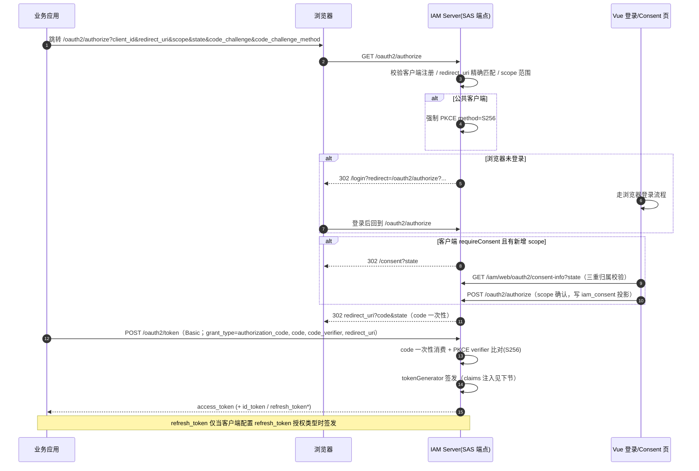
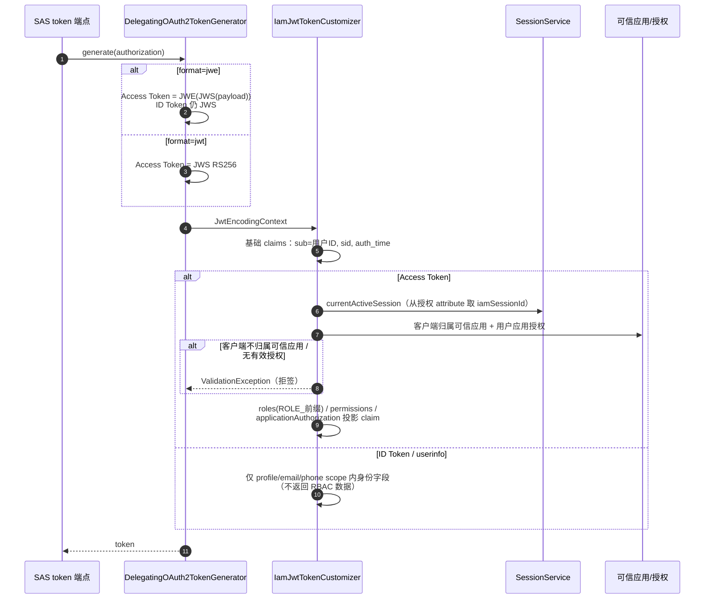
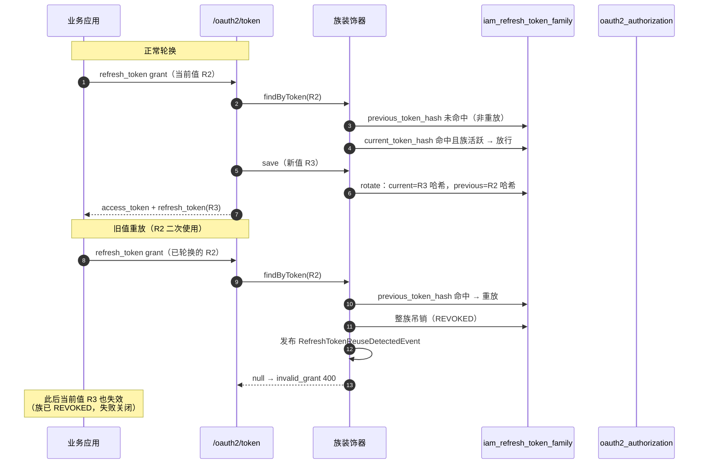
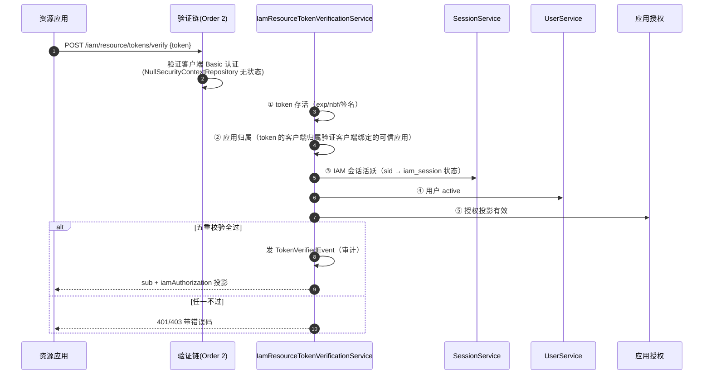

# OAuth2 与令牌验证

IAM Server 授权协议域：OAuth 2.1 授权码 + PKCE + Consent、Token 签发与 claims 注入、资源端 Token 验证，以及业务应用接入规则。模块总览与端点索引见根 [README](../../README.md)，配置参考见 [配置与多实例部署](配置与多实例部署.md)。

## OAuth 2.1 授权码 + PKCE + Consent 完整流程

要点：

- 授权码与 `state` 均一次性；`code_challenge` / `state` / `nonce` 落库存 SHA-256 哈希
- Token 换取不依赖浏览器 Cookie（授权码流程后端可独立完成）
- Consent 决定除写 SAS 标准表外，同步投影到 `iam_consent`（供管理面审计）；已确认过的 scope 不再询问

## Token 签发与 claims 注入

要点：

- `sub` 是稳定的 IAM 用户 ID（不是 username），资源端据此关联用户
- `sid` 把 Access Token 与 IAM 会话绑定：会话吊销后资源端验证即失效（即使 token 未到期）
- `roles` / `permissions` 只写入交互用户的 Access Token；ID Token 和 userinfo 不返回 RBAC 数据
- 应用授权投影 claim 要求 OAuth 客户端必须归属可信应用，未归属直接拒签（投影是业务准入依据，不容无主客户端）

## Refresh Token 主动防线（轮换 / 重放族吊销 / 过期清理）

客户端全局开启一次性使用（`reuseRefreshTokens=false`）：refresh grant 必轮换签发新值；旧值二次使用视为重放，整族吊销。`IamRefreshTokenFamilyAuthorizationService` 装饰在授权服务链最外层，把 `iam_refresh_token_family` 族表接到 SAS 授权生命周期。

要点：

- **建族**：授权码流程首次签发 refresh token 时建族（current=首值哈希，绑定用户与会话）；**轮换**：save 检测 refresh 值变化，旧哈希落 previous、新哈希落 current
- **失败关闭**：族行不存在 / 已吊销 / 已过期一律拒绝（invalid_grant）——授权缓存快照不能越过族状态
- **吊销联动**：登出、禁用、删除、改密均先吊销该用户全部族，再物理清理授权行（双路径幂等）
- **TTL**：`token.access-expires-in`（默认 1800 秒）与 `token.refresh-expires-in`（默认 36000 秒）写入客户端 tokenSettings，随注册落库
- **过期清理**：族表按 `expires_at` 分批删除 + 授权表 refresh / access / code 三路过期清理，每天凌晨 2 点（`cleanup.*` 配置组），多实例分布式锁互斥抢跑
- **事件**：重放检测发布 `RefreshTokenReuseDetectedEvent`（订阅方落审计）；族维护失败宁可签发失败（客户端重走授权码流程），不放行防不住的 token

## 资源端 Token 验证（远程模式）

`simple-iam-resource-server-starter` 就是本端点的受控验证客户端封装：经 `IamResourceTokenVerificationClient` SPI（HTTP 实现）调用 verify 端点并映射为资源认证结果，JWE 格式 token 同样可验（解密在 IAM 侧）。业务方也可用标准 Spring Security resource-server 对 JWKS 本地验签（仅自包含 `jwt` 格式；本地验签感知不到会话吊销与用户禁用，实时性弱于受控验证）。

## OAuth2 / OIDC 接入规则（业务应用视角）

1. **先在管理台建可信应用 + OAuth 客户端**：客户端授权类型仅允许 `authorization_code`（可伴生 `refresh_token`）；机器凭证不走本服务（用 aksk-server 的 AK/SK）
2. **授权码 + PKCE**：公共客户端强制 `S256`；机密客户端用 `client_secret_basic` 认证
3. **redirect_uri 精确匹配**：注册几个、用几个，不支持通配
4. **scope 逐个注册**：OIDC 标准 scope（`openid` / `profile` / `email` / `phone`）与业务 scope 均需在客户端注册范围内
5. **Consent**：客户端 `requireConsent=true` 时首次授权弹确认页；确认结果记入 `iam_consent`，scope 不变不再询问
6. **token 校验**：推荐 `simple-iam-resource-server-starter`（受控验证客户端，封装 `POST /iam/resource/tokens/verify` 调用，五重校验含会话与用户状态，JWE 同样可验）；业务方也可用标准 resource-server + JWKS 对 `jwt` 格式本地验签（感知不到会话吊销，实时性弱）
7. **Refresh Token**：默认不签发；客户端显式配置 `refresh_token` 授权类型后签发；全局一次性使用——每次 refresh grant 轮换新值，旧值二次使用触发整族吊销（含当前值，详见上节「Refresh Token 主动防线」）
8. **1.0.0 无 introspection / revocation 端点**（SAS 0.4.1 未提供）；token 失效以会话联动吊销与短有效期兜底
