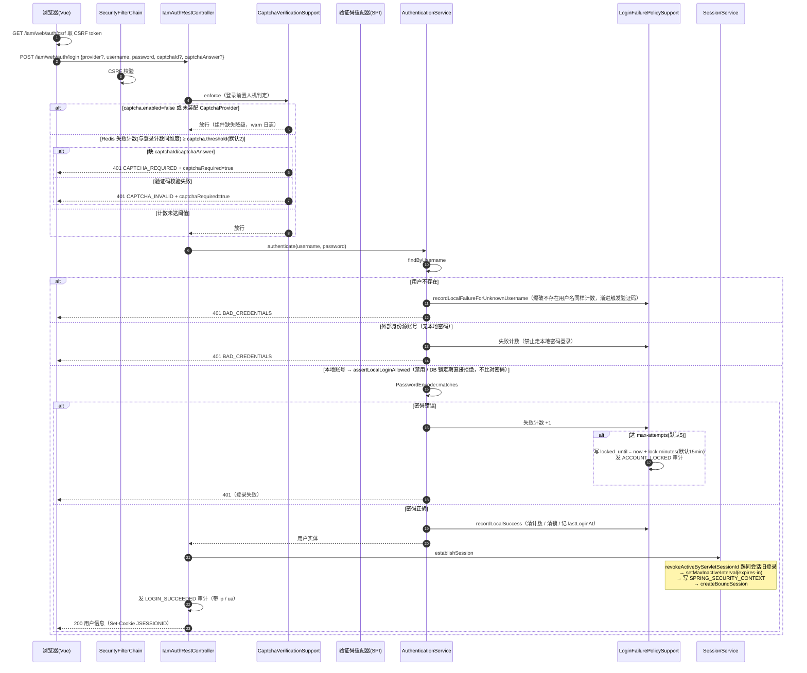
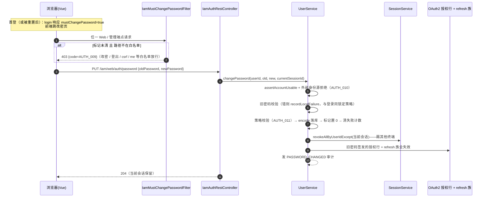
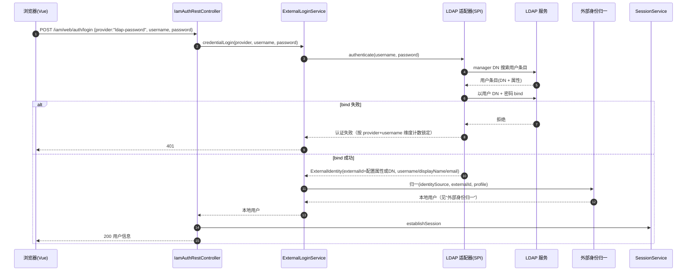
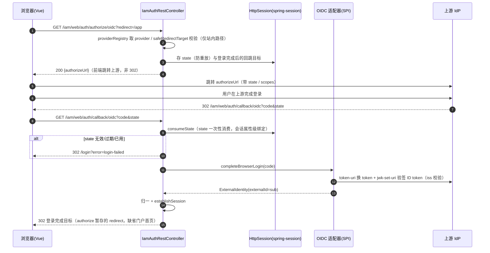
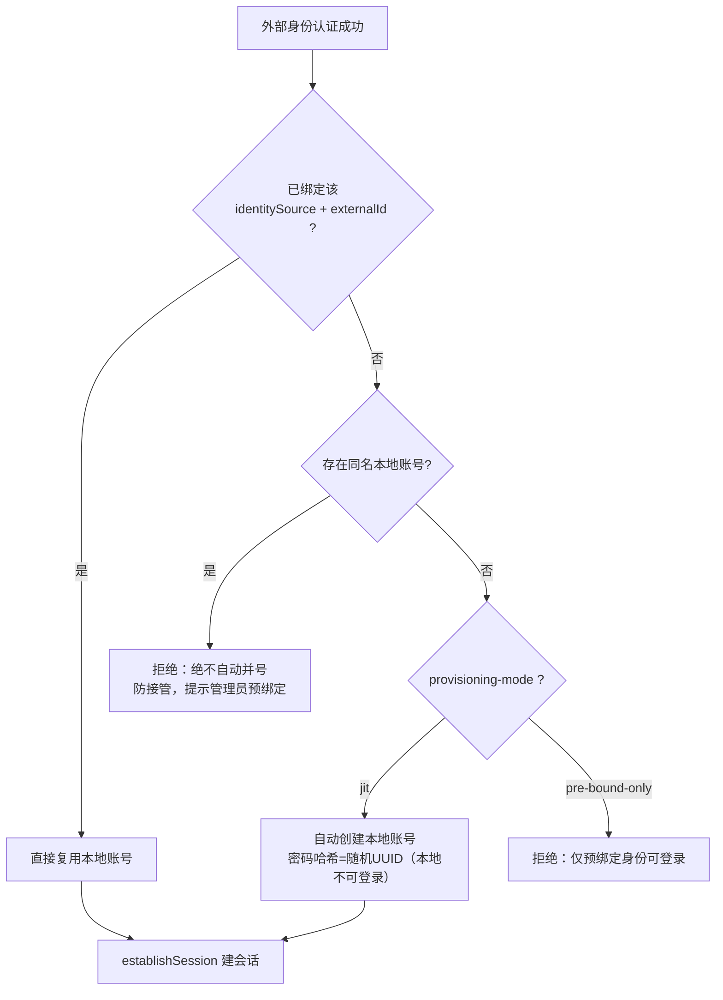
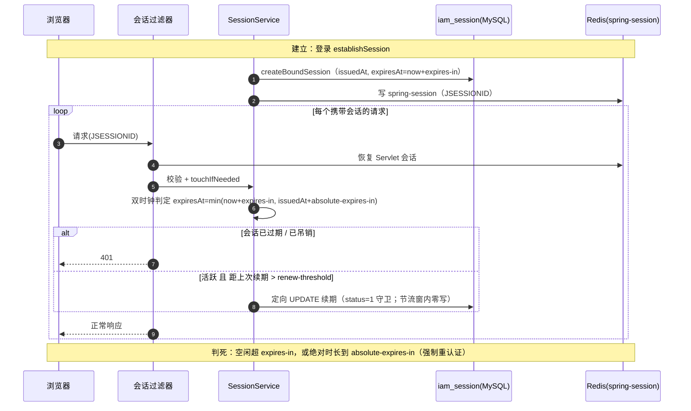
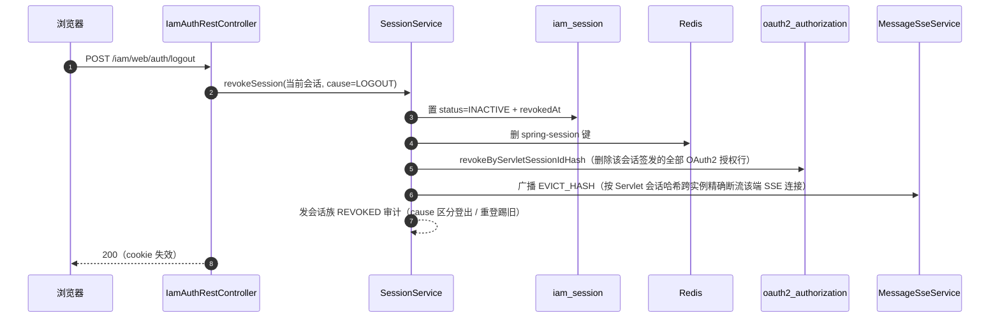
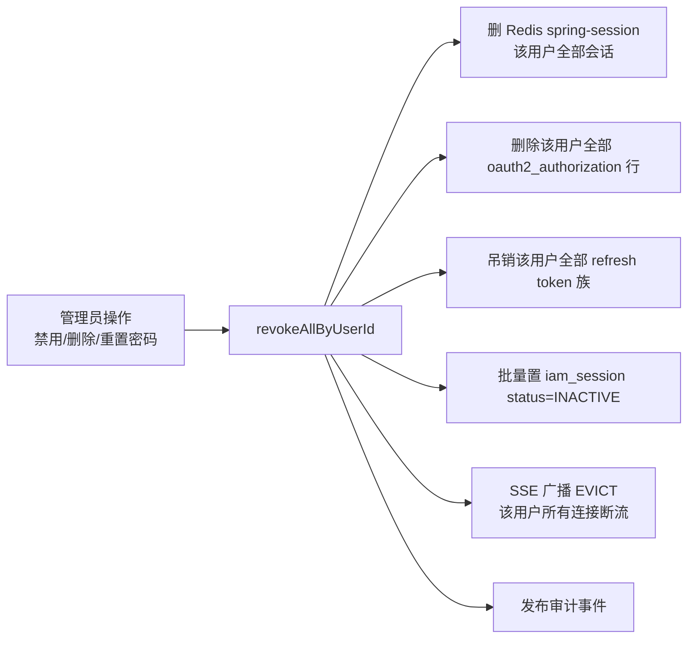

# 登录认证与会话

IAM Server 认证域：本地账号登录（渐进验证码、失败锁定）、外部身份源登录（LDAP / OIDC）与身份归一、会话生命周期、登出与吊销。模块总览与端点索引见根 [README](../../README.md)，配置参考见 [配置与多实例部署](配置与多实例部署.md)。

## 浏览器登录（本地账号 + 渐进验证码 + 失败锁定）

要点：

- 验证码先于凭据校验：验证码失败不消耗密码失败次数，也不泄露"密码是否正确"；失败计数在 Redis、与登录失败策略同维度
- 未知用户名的爆破同样计数渐进触发验证码（防用户名枚举）
- 锁定状态存数据库 `locked_until`，跨实例生效；锁定期内不比对密码（防暴力破解窗口）；管理员可 `PUT /iam/admin/users/{userId}/unlock` 手动解锁（清 `locked_until` 与失败计数，发 `UNLOCKED` 审计），不等 15 分钟自动过期
- 登录成功会先撤销同一 Servlet 会话上的旧登录（切换账号不留旧身份）
- 登录成功 / 失败均发认证族审计事件（带来源 ip 与 User-Agent）

## 自助修改密码与首登强制改密

登录响应携带 `mustChangePassword`：管理员建号（`createUser`）与重置密码（`resetPassword`）置 `iam_user.must_change_password=1`——管理员发出的都是临时密码；自助改密成功清零。

要点：

- 错旧密码计入凭据失败计数：改密端点与登录共用锁定策略，爆破旧密码同样触发账号锁定；改密成功顺带清失败计数与锁定（`locked_until` 置空）
- 踢其他终端保留当前会话：改密完成后当前浏览器不掉线，其余终端（含旧 refresh token）全部失效
- 标记同步走 principal 热刷新机制：`IamSessionValidationFilter` 每请求从用户实体对齐 `mustChangePassword`，改密成功后拦截立即解除，无需重登
- 拦截范围两条链（Web `/iam/web/**` 与管理 `/iam/admin/**`）；`password.must-change-enforcement` 仅测试场景可关，生产关闭等于放弃首登强制改密防线
- 外部身份源（LDAP / OIDC）用户改密与被重置均拒绝（AUTH_010）：其密码由外部系统管理，若允许重置会置须改密标记而改密又被拒，形成永久锁死

## 外部身份登录——LDAP 凭证型

LDAP 模式下用户在本服务登录页输入域账号密码，密码由上游 LDAP 验证（bind），账号按首次见到时归一。

login 端点对凭证型外部登录的错误分流（controller 内 `@ExceptionHandler`）：上游不可用 503（`EXTERNAL_PROVIDER_UNAVAILABLE`）、登录方式不存在 404、其余业务错误 401。

## 外部身份登录——OIDC 跳转型

要点：

- `state` 为 UUID、存 HttpSession 属性（spring-session 下多实例互认），回调时一次性消费——防 CSRF / 跨站授权码注入
- 回调失败 302 回登录页并附 `error` 查询参数；错误码默认透传前端引导，仅账号锁定（`ACCOUNT_LOCKED`）降级为 `login-failed`——锁定事实不向未认证方泄露，防回调爆破探测；发起时登录方式不存在返回 404
- 跳转型失败按 `provider` 维度计数（上游故障不锁单个用户）

## 外部身份归一（三步判定）

同名拦截是安全底线：外部身份源对"谁能叫这个用户名"的判定与本地体系不一致，自动并号等于把账号控制权交给上游。

## 会话生命周期

要点：

- 双时钟：无论怎么活跃，`absolute-expires-in`（默认 10 小时）到点必须重新认证；滑动续期只前移 `expires_at`，不改 `issued_at`
- 续期节流：节流窗（默认 300s）内的活跃请求不落库，空闲用户零写
- 多实例互认：会话状态在 MySQL + Redis，任何实例都能校验与续期，无需粘性路由

## 登出与联动吊销（单端）

登出不只是删 Servlet 会话：该会话签发过的所有 token（授权行）一并物理删除，资源端后续验证全部失败。

## 用户级全端吊销

禁用用户、删除用户、管理员重置密码时触发 `revokeAllByUserId`：

