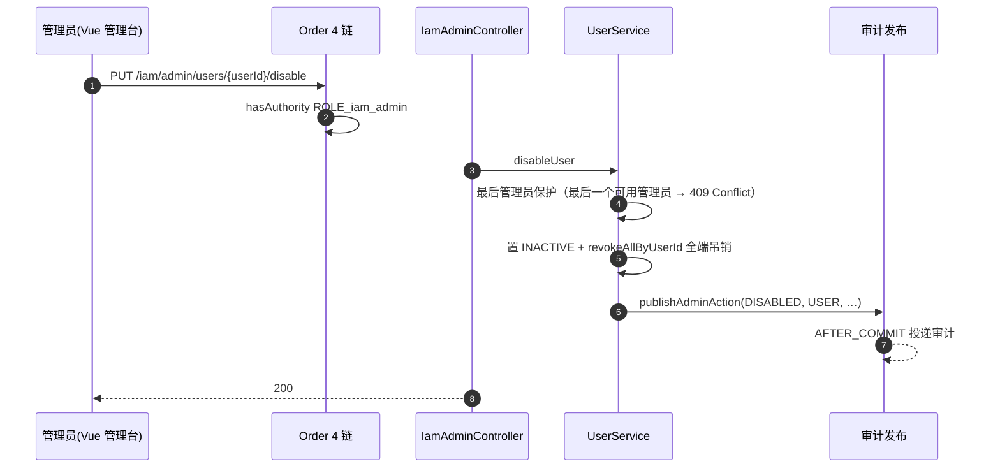
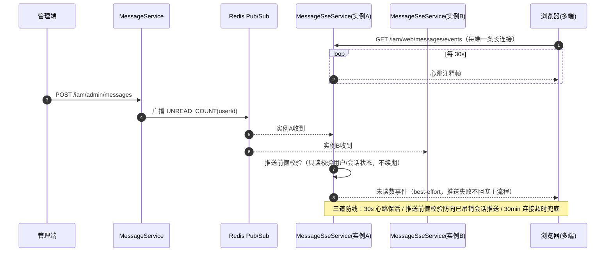

# 管理台与站内信

IAM Server 管理面域：各族管理操作的统一模式、可信应用族的特殊点、SSE 站内信实时推送。模块总览与端点索引见根 [README](../../README.md)。

## 管理面操作（统一模式）

管理面各族操作走同一模式，以用户禁用为例（部门 / 协作组 / 角色 / 权限 / 可信应用 / 应用授权 / 验证客户端 / 站内信同构）：

可信应用族的特殊点：创建应用必须带初始客户端，CONFIDENTIAL 初始客户端密钥留空时由服务端生成，创建响应（`initialClientSecret`）与应用下新增客户端响应均仅返回一次明文，后续查询仅 `secretPresent`；级联删除顺序为菜单 → Portal → 权限清单 → 授权规则 → 应用授权投影 → Consent 投影 → 客户端 → 应用。

## 仪表盘与会话管理

- `GET /iam/admin/dashboard`：管理台首页聚合——治理计数（用户 / 部门 / 协作组 / 角色 / 权限 / 可信应用）+ 运行态（在期会话数 / 今日登录人数 / 锁定 / 禁用 / 无部门用户）；`GET /iam/admin/dashboard/recent-logins` 分页最近登录（用户 / 部门 / 最后登录时间）。两者 `iam:dashboard:api`
- `GET /iam/admin/sessions`：在期会话分页（可按 `userId` 过滤），含会话 / 用户 / 客户端 / IP / User-Agent / 认证时间 / 最后活跃 / 到期时间；`PUT /iam/admin/sessions/users/{userId}/revoke` 强制下线该用户全部终端（复用用户级全端吊销：删 Redis 会话 + 物理删 OAuth 授权行 + refresh 族吊销 + SSE 断流，返回吊销数并发 `REVOKED` 审计）。两者 `iam:session:api`

## 站内信发送批次查询

管理端发送走 `POST /iam/admin/messages`（见 SSE 节），发送后的追溯查询三个端点：`GET /iam/admin/messages/page` 批次分页（标题 / 发送人 / 目标构成——用户·部门·协作组计数与是否含子部门 / 收件与已读计数）、`GET /iam/admin/messages/{sendBatchId}` 批次详情（含正文）、`GET /iam/admin/messages/{sendBatchId}/recipients` 收件人分页（含 `readAt` 已读时间）。均 `iam:message:api`。

## SSE 站内信实时推送

跨实例：用户连接在实例 A、站内信从实例 B 进来，靠 Pub/Sub 广播三类消息（`UNREAD_COUNT` / `EVICT` / `EVICT_HASH`）保证两端都推到。
