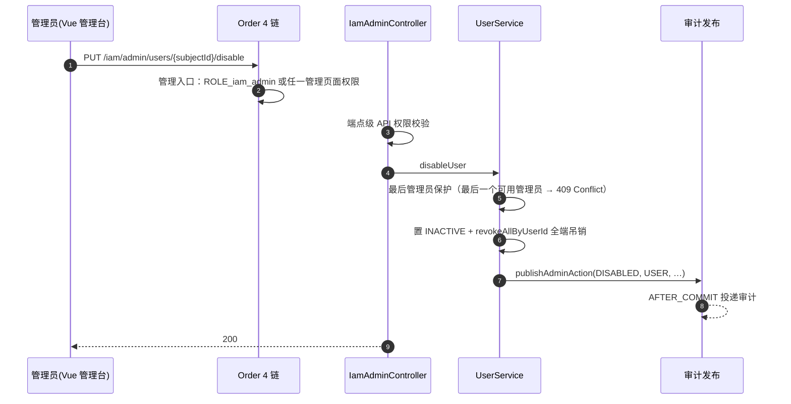
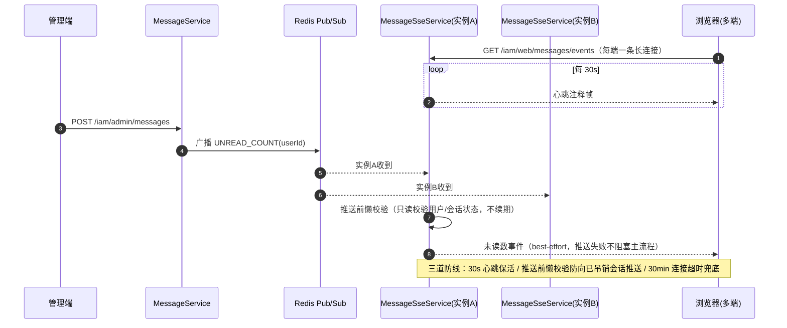

# 管理台与站内信

IAM Server 管理面域：各族管理操作的统一模式、可信应用族的特殊点、SSE 站内信实时推送。模块总览与端点索引见根 [README](../../README.md)。

## 管理面操作（统一模式）

管理面各族操作走同一模式，以用户禁用为例（部门 / 协作组 / 角色 / 权限 / 可信应用 / 应用授权 / 验证客户端 / 站内信同构）：


```mermaid
sequenceDiagram
    autonumber
    participant Adm as 管理员(Vue 管理台)
    participant F as Order 4 链
    participant CS as IamAdminController
    participant US as UserService
    participant AU as 审计发布

    Adm->>F: PUT /iam/admin/users/{subjectId}/disable
    F->>F: 管理入口：ROLE_iam_admin 或任一管理页面权限
    CS->>CS: 端点级 API 权限校验
    CS->>US: disableUser
    US->>US: 最后管理员保护（最后一个可用管理员 → 409 Conflict）
    US->>US: 置 INACTIVE + revokeAllByUserId 全端吊销
    US->>AU: publishAdminAction(DISABLED, USER, …)
    AU-->>AU: AFTER_COMMIT 投递审计
    CS-->>Adm: 200
```

可信应用创建必须带初始客户端，CONFIDENTIAL 初始客户端密钥留空时由服务端生成，创建响应（`initialClientSecret`）与应用下新增客户端响应均仅返回一次明文，后续查询仅 `secretPresent`。删除不是同步级联完成：服务先安全停用应用并受理持久化清理任务，返回 202 与操作信息，后台分批清理 OAuth 授权及关联配置后完成物理删除；调用方须查询任务结果，不能把受理当成删除完成。失败任务需显式重试，重复 DELETE 不隐式重启失败任务。内置应用仍禁止删除及安全停用。

Portal 菜单、应用默认入口、登录首页和沉浸页路由的配置与安全边界见 [Portal 默认入口与沉浸页路由](Portal默认入口与沉浸页路由.md)。

用户详情响应含只读口令状态两字段（1.3.6，可空）：`passwordUpdatedAt`（密码最近设置时刻，null=生存期策略未激活）与 `passwordExpiresInDays`（临期 1..N / 已过期 0 / 策略关闭或未激活 null）——正常/临期/过期由前端按两字段渲染，服务端不设状态枚举。管理员重置密码会刷 `passwordUpdatedAt` 并置 `PASSWORD_RESET` 须改密原因（新密码不得与当前密码相同，1.3.6 假换密拦截）。口令生存期判定与登录联动语义见 [登录认证与会话](登录认证与会话.md)。

## 受委托角色的管理操作（1.3.2）

受委托角色由外部服务创建，仍使用既有角色、应用规则与部门关系。管理员通过原管理端点维护它，但不能绕过固定应用、部门根和共同版本；普通角色保留原调用方式。

`GET /iam/admin/roles/{roleId}` 返回只读 `openRoleBinding`：

```json
{
  "openRoleId": "20000000-0000-4000-8000-000000000001",
  "applicationId": 10,
  "rootDepartmentId": 20,
  "revision": 2,
  "state": "ACTIVE"
}
```

普通角色该字段为 `null`。`roleId` 是管理端的数字角色编号，`openRoleId` 是开放接口的稳定 UUID，不可互换。前端以摘要构造强版本标记 `"open-role:<openRoleId>:<revision>"`，例如 `If-Match: "open-role:20000000-0000-4000-8000-000000000001:2"`。它用于防止覆盖另一位管理员或服务刚提交的修改。

| 操作 | 端点 | 受委托角色要求 |
|---|---|---|
| 改名 / 描述 | `PUT /iam/admin/roles/{roleId}` | 提交强 If-Match；不能改编码、归属、应用或根 |
| 替换 / 清除应用规则 | `PUT / DELETE /iam/admin/roles/{roleId}/authorization-rules/{applicationId}` | 提交强 If-Match；只允许固定应用，规则符合其当前清单 |
| 部门挂载 / 撤销 | `POST / DELETE /iam/admin/departments/{departmentId}/roles/{roleId}` | 提交强 If-Match；新增须在当前固定根子树内，撤销允许清理迁出或消失部门的残留关系 |
| 删除 | `DELETE /iam/admin/roles/{roleId}` | 提交强 If-Match；清理角色、规则、关系及投影贡献，保留委托墓碑 |

缺少条件返回 428，旧版本返回 412，非法标记返回 400；弱标记、通配符及标记列表不被接受。冲突或超时后重读角色摘要及编辑对象、重新核对差异，再由管理员确认提交，不能换新标记后盲重发旧内容。无实际变化不递增 revision、不重复重算投影或发布变更审计。

受委托角色禁止个人直授、传统全局权限和跨应用规则。直属部门成员继承该角色，父部门挂载不自动覆盖子部门；需要整棵子树时逐部门挂载。角色删除保留 `DELETED` 墓碑，原创建键不能重新创建；有 ACTIVE 委托引用的目标应用或根不能删除，目标应用也不能改为内置应用，返回 409，须先清理受委托角色。

管理端仍使用 IAM 人员会话与 CSRF（防跨站请求伪造）校验，端点级权限不因服务委托而放宽。前端识别摘要并提交条件是接入要求，不代表某个已发布前端版本已完成适配。IAM 角色和菜单可见性只提供权限事实；商业有效期、产品资格和授权失效后的业务拒绝由消费方执行。

受委托角色变更复用 `AdminActionEvent`，`detail` 为最小 JSON 元数据：操作、请求关联号、稳定角色标识、固定应用/根、revision、实际操作者身份，部门关系变更另含部门编号。操作者取可信服务身份或管理员登录主体，不以角色所有者冒充。事务内变更在提交后由审计监听器尽力消费，回滚、创建重放及无变化写入不产生新的成功变更记录；默认日志不输出完整 detail，持久化需宿主提供 `ServerIamAuditHandler`，不承诺可靠投递或失败重试。

## 仪表盘与会话管理

- `GET /iam/admin/dashboard`：管理台首页聚合——治理计数（用户 / 部门 / 协作组 / 角色 / 权限 / 可信应用）+ 运行态（在期会话数 / 今日登录人数 / 锁定 / 禁用 / 无部门用户）；`GET /iam/admin/dashboard/recent-logins` 分页最近登录（用户 / 部门 / 最后登录时间）。两者 `iam:dashboard:api`
- `GET /iam/admin/sessions`：在期会话分页（可按 `subjectId` 过滤），含会话 / 用户 / 客户端 / IP / User-Agent / 认证时间 / 最后活跃 / 到期时间；`PUT /iam/admin/sessions/users/{subjectId}/revoke` 强制下线该用户全部终端（复用用户级全端吊销：删 Redis 会话 + 物理删 OAuth 授权行 + refresh 族吊销 + SSE 断流，返回吊销数并发 `REVOKED` 审计）。两者 `iam:session:api`

## 站内信发送批次查询

管理端发送走 `POST /iam/admin/messages`（见 SSE 节），发送后的追溯查询三个端点：`GET /iam/admin/messages/page` 批次分页（标题 / 发送人 / 目标构成——用户·部门·协作组计数与是否含子部门 / 收件与已读计数）、`GET /iam/admin/messages/{sendBatchId}` 批次详情（含正文）、`GET /iam/admin/messages/{sendBatchId}/recipients` 收件人分页（含 `readAt` 已读时间）。均 `iam:message:api`。

## SSE 站内信实时推送


```mermaid
sequenceDiagram
    autonumber
    participant Adm as 管理端
    participant MS as MessageService
    participant Pub as Redis Pub/Sub
    participant SA as MessageSseService(实例A)
    participant SB as MessageSseService(实例B)
    participant B as 浏览器(多端)

    B->>SA: GET /iam/web/messages/events（每端一条长连接）
    loop 每 30s
        SA-->>B: 心跳注释帧
    end
    Adm->>MS: POST /iam/admin/messages
    MS->>Pub: 广播 UNREAD_COUNT(userId)
    Pub-->>SA: 实例A收到
    Pub-->>SB: 实例B收到
    SA->>SA: 推送前懒校验（只读校验用户/会话状态，不续期）
    SA-->>B: 未读数事件（best-effort，推送失败不阻塞主流程）
    Note over SA,B: 三道防线：30s 心跳保活 / 推送前懒校验防向已吊销会话推送 / 30min 连接超时兜底
```

跨实例：用户连接在实例 A、站内信从实例 B 进来，靠 Pub/Sub 广播三类消息（`UNREAD_COUNT` / `EVICT` / `EVICT_HASH`）保证两端都推到。
