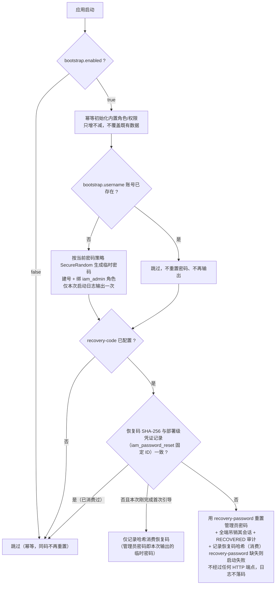
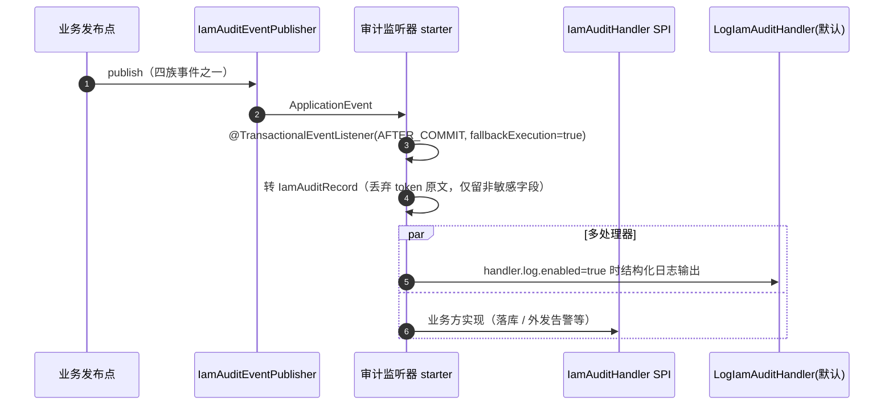

# 配置与多实例部署

IAM Server 配置域：全量配置参考（本体 + 配套组件 + 适配器 + 审计监听器）、敏感信息边界、多实例部署、启动引导恢复码、审计事件流。模块总览与端点索引见根 [README](../../README.md)。

## 全量配置参考

### IAM 本体配置

前缀：`io.github.surezzzzzz.sdk.auth.iam.server`。以下为全部配置项与默认值；生产必须显式关注的项以**粗体**标注。

#### 顶层

| 配置项 | 默认值 | 说明 |
|---|---|---|
| `enable` | `true` | 总开关 |
| **`issuer`** | `http://localhost:8180` | Token 签发者（`iss`）与 OIDC discovery 基地址，生产必须改为对外可达地址（多实例下为负载均衡地址） |
| `me` | `default` | 应用标识，注入所有 Redis / Cache / Lock / Limiter key 与 spring-session namespace 的 `me` 段；多套服务共用 Redis 时用它隔离 |

#### `security`（安全依赖守门）

对应配套组件未就绪则启动失败——防止"看起来在跑、实际上会话 / 限流全部旁路"的静默降级。全部默认 `true`。

| 配置项 | 默认值 | 说明 |
|---|---|---|
| `security.require-redis` | `true` | 要求 Redis 路由就绪 |
| `security.require-cache` | `true` | 要求二级缓存就绪 |
| `security.require-limiter` | `true` | 要求限流组件就绪 |
| `security.require-lock` | `true` | 要求分布式锁就绪 |

#### `token`

| 配置项 | 默认值 | 说明 |
|---|---|---|
| `token.format` | `jwt` | `jwt`（JWS RS256）或 `jwe`（Access Token 外层 AES-256 加密，ID Token 仍 JWS）；非法值启动失败 |
| `token.key-id` | `sure-auth-iam-2026` | JWK key id；密钥轮换期换新值实现新旧并存 |
| `token.access-expires-in` | `1800` | Access Token 有效期（秒，默认 30 分钟）；写入客户端 tokenSettings，随注册落库 |
| `token.refresh-expires-in` | `36000` | Refresh Token 有效期（秒，默认 10 小时），仅签发 refresh 时生效；refresh token 全局一次性使用（轮换开启） |
| **`token.public-key`** | 无 | RSA 公钥（PEM），生产必须显式注入 |
| **`token.private-key`** | 无 | RSA 私钥（PEM），与公钥成对 |
| `token.encryption-key` | 无 | AES-256 密钥（Base64 编码的 32 字节），仅 `format=jwe` 时必填 |

#### `session`

| 配置项 | 默认值 | 说明 |
|---|---|---|
| `session.expires-in` | `1800` | 滑动空闲超时（秒）：活跃即续，空闲该时长会话判死 |
| `session.absolute-expires-in` | `36000` | 绝对上限（秒）：自签发起的最长会话时长，到期强制重认证；启动校验必须大于 `expires-in` |
| `session.renew-threshold` | `300` | 续期节流窗（秒）：距上次续期超过该窗口的活跃请求才落库续期，空闲用户零写 |
| `session.redis-namespace` | `sure-auth-iam:spring-session:{me}` | spring-session namespace；缺省时动态跟随 `me` |
| `session.redis-configure-action` | 无 | 托管 Redis 禁止 `CONFIG` 命令时设为 `noop`，跳过 keyspace notifications 探测 |

> 生效边界：登录会话的空闲超时在建会话时按 `session.expires-in` 逐会话写入；spring-session 装配层的注解默认值固定 1800，仅对未登录的匿名会话（如仅取过 CSRF token 的会话）生效。

#### `login`

| 配置项 | 默认值 | 说明 |
|---|---|---|
| `login.max-attempts` | `5` | 连续失败上限，达到即锁定 |
| `login.lock-minutes` | `15` | 锁定时长（分钟） |

计数维度：本地登录按 `username`；外部凭证型按 `provider + username`；外部跳转型按 `provider`。成功登录后清零；锁定期存数据库 `locked_until`，未到期直接拒绝（不比对密码，跨实例生效）。

#### `captcha`

| 配置项 | 默认值 | 说明 |
|---|---|---|
| `captcha.enabled` | `true` | 验证码总开关，关闭则从不要求验证码 |
| `captcha.threshold` | `2` | 触发人机验证的登录失败次数（达到即要求验证码；锁定兜底仍由 `login.max-attempts` 控制） |

未装配验证码组件（classpath 无 captcha 适配器）时自动降级放行，不阻断登录。

#### `mfa`（1.0.0 预留）

| 配置项 | 默认值 | 说明 |
|---|---|---|
| `mfa.enabled` | `false` | 仅 SPI 预留，默认关闭，当前无实现 |

#### `password`

| 配置项 | 默认值 | 说明 |
|---|---|---|
| `password.min-length` | `8` | 密码最小长度 |
| `password.max-length` | `64` | 密码最大长度 |
| `password.require-uppercase` | `true` | 要求大写字母 |
| `password.require-lowercase` | `true` | 要求小写字母 |
| `password.require-digit` | `true` | 要求数字 |
| `password.require-special` | `true` | 要求特殊字符 |
| `password.must-change-enforcement` | `true` | 首登 / 重置后强制改密拦截开关：管理员建号与重置密码置须改密标记，标记未清期间非白名单端点 403；仅测试场景可关，生产关闭等于放弃该防线 |

策略在自助改密、建用户、管理员重置密码时统一校验；登录不校验策略（存量弱密码不阻断登录）。

#### `cleanup`

| 配置项 | 默认值 | 说明 |
|---|---|---|
| `cleanup.enable` | `true` | 过期 token 定时清理开关，false 时清理任务不装配 |
| `cleanup.cron` | `0 0 2 * * ?` | 清理调度 cron（默认每天凌晨 2 点） |
| `cleanup.batch-size` | `2000` | 分批删除单批行数上限（每批独立事务防长事务锁表） |
| `cleanup.lock-lease-seconds` | `600` | 多实例分布式锁租约（秒）：抢到锁的实例执行，抢不到跳过 |

清理范围：`iam_refresh_token_family` 过期族 + `oauth2_authorization` 三路过期行（refresh / access / code）；只记日志不发事件不进审计表。

#### `registration` / `password-reset`（1.0.0 预留）

| 配置项 | 默认值 | 说明 |
|---|---|---|
| `registration.open` | `false` | 开放注册开关，当前无对应实现（开户走管理员建账） |
| `password-reset.self-service` | `false` | 自助重置开关，当前无对应 HTTP 端点（`PasswordResetService` 的 token 凭证机制已实现未暴露；重置走 `PUT /iam/admin/users/{userId}/reset-password`） |

#### `bootstrap`

| 配置项 | 默认值 | 说明 |
|---|---|---|
| `bootstrap.enabled` | `true` | 启动引导开关 |
| `bootstrap.username` | `admin` | 引导创建的管理员用户名 |
| `bootstrap.recovery-code` | 无 | 部署注入的一次性管理员恢复码，不得写入版本库或日志 |
| `bootstrap.recovery-password` | 无 | 恢复后的新密码，同上 |
| `bootstrap.built-in-applications` | 内置 IAM 管理台项 | 引导注册的内置应用列表；每项 `applicationCode` / `applicationName` / `description` / `routePrefix`（缺省 `/micro/{applicationCode}`）/ `entry`（微前端地址，置空跳过）/ `apiBase` / `menus`（code / name / route 菜单树），部署方按环境覆盖 entry 与 apiBase |

行为：

- 启动期幂等初始化内置角色 / 权限 / 管理员（只增不减，不覆盖既有数据）
- 同时引导默认根部门与内置应用（应用编码已存在即跳过，管理员改过的 entry / 菜单不被覆盖）及其权限清单、`iam_admin` 全量授权规则与管理员准入
- `bootstrap.username` 账号不存在时，按当前密码策略生成随机临时密码、仅在本次启动后端日志中输出一次并创建内置管理员；账号已存在时不会重置密码、也不会再次输出
- `recovery-code` 配置时启动期按 SHA-256 与部署级凭证记录比对实现幂等消费（同码不再重置）；本次启动刚完成首次引导时只消费不重置，其余情况用 `recovery-password` 重置管理员密码并全端吊销其会话、发 RECOVERED 审计——`recovery-password` 此时缺失则启动失败。整个流程不经过任何 HTTP 端点。用途：管理员密码遗失且库不可人工改动时的部署级逃生口；恢复码每次部署轮换，进版本库即视为泄露

#### `admin.theme`（管理台品牌）

| 配置项 | 默认值 | 说明 |
|---|---|---|
| `admin.theme.brand-name` | `统一认证中心` | 品牌名称 |
| `admin.theme.logo-url` | 无 | 自定义 Logo 地址 |
| `admin.theme.custom-css-url` | 无 | 自定义 CSS 地址 |
| `admin.theme.custom-js-url` | 无 | 自定义 JS 地址 |

Vue 管理台经 `GET /iam/web/branding` 读取。

#### `external-identity`

| 配置项 | 默认值 | 说明 |
|---|---|---|
| `external-identity.provisioning-mode` | `jit` | 未绑定身份的处置：`jit`（首次登录自动创建本地账号）或 `pre-bound-only`（仅管理员预绑定身份可登录） |
| `external-identity.callback-base-url` | 空（按请求推断） | 跳转型登录回调地址基础 URL（含协议主机端口，不含路径）；反向代理导致请求 Host 不可信时必须显式配置（多实例 OIDC 场景须配负载均衡地址） |
| `external-identity.providers.<code>.name` | 无（回退编码本身） | 登录方式展示名（登录页按钮文案） |
| `external-identity.providers.<code>.description` | 无 | 登录方式描述 |

`<code>` 为登录方式编码（如 `ldap-password`、`oidc`），与适配器注册的编码一致。

### 配套组件配置（宿主必须配齐）

本模块依赖自有 SDK 五件（mysql-route / redis-route / lock / limiter / cache），按各组件文档配置。以下为 IAM 场景的关键接线形态。

**mysql-route**（数据源路由）：

```yaml
io.github.surezzzzzz.sdk.mysql.route:
  enable: true
  primary-datasource: default
  datasources:
    default:
      url: jdbc:mysql://127.0.0.1:3306/sure_auth_iam?useUnicode=true&characterEncoding=utf8&serverTimezone=Asia/Shanghai
      username: <数据库账号>
      password: <数据库密码>   # 经环境变量或本地 profile 注入，不进版本库
```

**redis-route**：多套服务共用 Redis 时以 database 号或前缀隔离（多实例要求版本 ≥ 1.2.0）。

**lock / cache**：按各组件文档接入。缓存建议 `key-prefix: sure-auth-iam`、L1 短 TTL（如 10s）、L2 长 TTL、strong 一致性、routed pubsub，反序列化 `trusted-packages` 须包含 `io.github.surezzzzzz.sdk.auth.iam.server` 与 `org.springframework.security.oauth2.server.authorization`（授权缓存条目为 SAS `OAuth2Authorization` 对象，缺后者时 L2 读侧反序列化被拒、静默降级 L1）。

**匿名端点限流**：`GET /iam/web/auth/csrf` 匿名可达且每请求都会建立 Redis 会话，已内置拦截器模式 IP 级限流消除会话膨胀放大。宿主需启用 smart-redis-limiter（`2.1.0+`，经本模块传递引入）并抄入下列规则：

```yaml
io:
  github:
    surezzzzzz:
      sdk:
        limiter:
          redis:
            smart:
              enable: true
              me: ${io.github.surezzzzzz.sdk.auth.iam.server.me}
              mode: interceptor
              # 429 响应统一由 IAM 异常处理出口返回（组件默认 advice 与宿主兜底 advice 平序不可控）
              management:
                enable-default-exception-handler: false
              interceptor:
                rules:
                  - path-pattern: /iam/web/auth/csrf
                    method: GET
                    resource-code: iam-web-csrf
                    key-strategy: ip
                    algorithm: sliding
                    fallback: allow
                    limits:
                      - count: 60
                        window: 1
                        unit: MINUTES
```

阈值含义为每 IP 每分钟 60 次取 Token（每次登录尝试取 1 次）。NAT 出口多人共享公网 IP 时按需放宽；`key-strategy: ip` 按链路取 `X-Forwarded-For` 首段，反向代理必须在可信边界外不可直连的前提下透传真实客户端 IP，否则伪造 XFF 可绕过限流。限流触发时返回 `429` 并携带 `Retry-After` 头；`security.require-limiter` 默认 `true`，limiter 未启用时启动即失败。

### 登录适配器配置

适配器是独立 starter，引入依赖即装配（无 enable 开关）；不引入则该登录方式不出现在登录页。

**OIDC 跳转型**（`simple-iam-oidc-adapter-starter`），前缀 `io.github.surezzzzzz.sdk.auth.iam.adapter.login.oidc`：

| 配置项 | 默认值 | 说明 |
|---|---|---|
| `issuer` | 无 | 上游 IdP 签发方标识，用于 ID token `iss` 校验 |
| `authorization-uri` | 无 | 上游授权端点 |
| `token-uri` | 无 | 上游令牌端点 |
| `jwk-set-uri` | 无 | 上游 JWKS 端点 |
| `client-id` | 无 | 在上游注册的客户端 ID |
| `client-secret` | 无 | 客户端密钥，经部署环境管理 |
| `scopes` | `openid,profile,email` | 请求上游的 scope 列表 |

**LDAP 凭证型**（`simple-iam-ldap-adapter-starter`），前缀 `io.github.surezzzzzz.sdk.auth.iam.adapter.login.ldap`：

| 配置项 | 默认值 | 说明 |
|---|---|---|
| `url` | 无 | LDAP 地址（含根 DN），如 `ldap://localhost:1389/dc=example,dc=org` |
| `manager-dn` | 无 | 搜索用户的服务账号 DN |
| `manager-password` | 无 | 服务账号密码，经部署环境管理 |
| `user-search-base` | 空 | 用户搜索基准 DN（相对根 DN） |
| `user-search-filter` | `(uid={0})` | 用户搜索过滤器；Windows AD 建议 `(sAMAccountName={0})` |
| `username-attribute` | `uid` | 用户名属性 |
| `display-name-attribute` | `cn` | 显示名属性 |
| `email-attribute` | `mail` | 邮箱属性 |
| `external-id-attribute` | 空（用条目 DN） | 外部稳定 ID 属性；为空时以用户条目 DN 作为 `externalId` |

**验证码**（`simple-iam-captcha-adapter-starter`）：无配置项，引入即装配；配合 `captcha.*` 控制触发策略。

### 审计监听器配置

`simple-iam-audit-listener-starter` 订阅本模块的审计事件，前缀 `io.github.surezzzzzz.sdk.audit.iam.server.listener`：

| 配置项 | 默认值 | 说明 |
|---|---|---|
| `handler.log.enabled` | `true` | 默认日志处理器开关；关闭后仅剩业务方自实现的 `IamAuditHandler` SPI |

### 敏感信息边界

- `token.private-key`、`token.encryption-key`、`bootstrap.recovery-code / recovery-password`、数据库与 LDAP 凭据、OIDC `client-secret`：一律经环境变量、密钥管理系统或未提交的本地配置读取，不得提交到代码库或日志
- 审计处理器不得记录 token 原文（监听器转 `IamAuditRecord` 时已丢弃 tokenValue）
- 日志中的密钥材料只出现 key-id，不出现密钥内容

## 多实例部署

会话（spring-session）、授权状态（MySQL + smart-cache）、授权交易（Redis）、SSE 广播（Pub/Sub）、限流 / 锁 / 缓存全部在共享存储——**无需粘性路由**，任意实例可服务任意请求。

多实例前提：全部实例共享同一 MySQL 与同一 Redis、配置同一 `me`、JWT 签名密钥与 issuer 一致，宿主 redis-route 版本 ≥ 1.2.0；OIDC 场景 `callback-base-url` 配负载均衡地址。

部署时由网关或反向代理保持下列路由边界：

| 路径 | 责任方 |
|---|---|
| `/login`、`/consent` | Vue Web |
| `/oauth2/**`、`/.well-known/**`、`/userinfo`、`/oauth2/jwks` | IAM Server |
| `/iam/web/**`、`/iam/admin/**`、`/iam/resource/**` | IAM Server JSON API |

前端接入顺序：

1. 登录页启动时调用 `GET /iam/web/branding` 获取品牌信息，并调用 `GET /iam/web/auth/csrf` 获取 CSRF Token。
2. 使用该 Token 调用 `POST /iam/web/auth/login`，浏览器保留 IAM Server 写入的会话 Cookie。
3. 使用 `GET /iam/web/auth/me` 恢复当前登录用户；注销调用 `POST /iam/web/auth/logout`。
4. 未认证用户访问 `/oauth2/authorize` 时，IAM Server 重定向到 Vue 的 `/login?redirect=...`；登录成功后 Vue 按 `redirect` 返回原授权请求。
5. SAS 需要用户确认授权时跳转 Vue 的 `/consent`；Vue 调用 `GET /iam/web/oauth2/consent-info?state=...` 渲染应用和 scope，再按 OAuth2 标准提交授权决定。
6. Portal 壳调用 `GET /iam/web/portal/accessible-applications` 获取当前用户可访问且已启用 Portal 集成的应用及菜单。

IAM Server 不托管 Vue 构建产物、静态页面、模板或微前端资源（Login、统一应用门户和 IAM Admin 分别在独立前端仓库维护）。

注意事项：

- `issuer` 配置为 LB 对外地址（token 里的 `iss` 与 discovery 端点才能被外部正确校验）
- 反向代理改写 Host 时，`external-identity.callback-base-url` 必须显式配置
- SSE 经过 nginx 类代理需禁缓冲（`proxy_buffering off`）并拉长读超时，否则事件帧被缓冲、跨实例推送假失败
- 限流的 IP 识别依赖可信边界外的 XFF 透传（见匿名端点限流）

## 启动引导与部署级恢复码



## 审计事件流



四族事件：**Token 族**（签发 / 验证 / 吊销 / Refresh 重用等）、**认证族**（登录成功失败 / 锁定 / 外部认证）、**会话族**（建立 / 续期 / 吊销）、**管理面族**（CRUD / 启禁用 / 密码重置等 AdminAction）。`AFTER_COMMIT` 保证审计反映已落库事实；无事务上下文时 fallback 直接执行。
